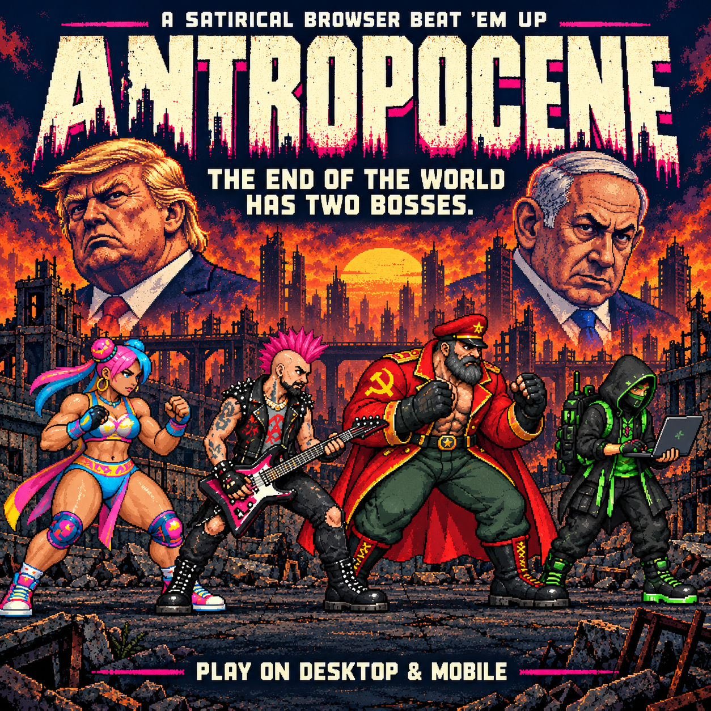

# Antropocene

A satirical browser beat ’em up by Francesco D’Isa, set in a ruined city with Trump and Netanyahu as its two bosses.

## Play offline

Extract this complete archive and double-click **index.html**. It contains the game code, images and fonts in a single file. A recent desktop browser with JavaScript enabled is required. No installation, account, server or internet connection is needed.

The game file is an unchanged copy of `PLAY.html` from the supplied Antropocene-Mac-Windows.zip, renamed for GitHub Pages. The original bilingual instructions are preserved in `LEGGIMI-README.txt`; where they say PLAY.html, open index.html instead.

## Controls

| Action | Keys |
| --- | --- |
| Move | WASD / arrow keys |
| Attack | J |
| Jump | K / Space |
| Special | L |
| Pause | Esc / P |

Select a fighter to begin. Use AUDIO to enable sound. There are no permanent saved games.

## GitHub Pages

Upload the contents of this folder to the root of a GitHub repository. In Settings → Pages, choose Deploy from a branch, select your branch (usually main), select / (root), and save. Use the published URL shown there to share the game. No build step is required.

## Promotional material

Recovered original promotional files are included in `promo/`:

- `cover-square.png`: illustrated square cover.
- `story-vertical.png`: illustrated vertical Story artwork.
- `01-rainbow-fury.png`, `02-the-perimeter.png`, `03-anarchist-chord.png`: three square game screens.
- `original-instagram-copy.md`: original post copy and production notes, preserved as an archive. Its publication-status note describes the original release, not your new GitHub deployment.

The promotional artwork shows four heroes, including the hacker. These files have been preserved as originally created.

## Source and credits

The editable HTML, CSS and JavaScript are inside `index.html`, together with embedded assets. This is the supplied self-contained distribution, not a reconstruction of the original development repository.

Keep `FONT-LICENSE.txt` with the distribution. The embedded DejaVu font notices are also retained inside the game file.
